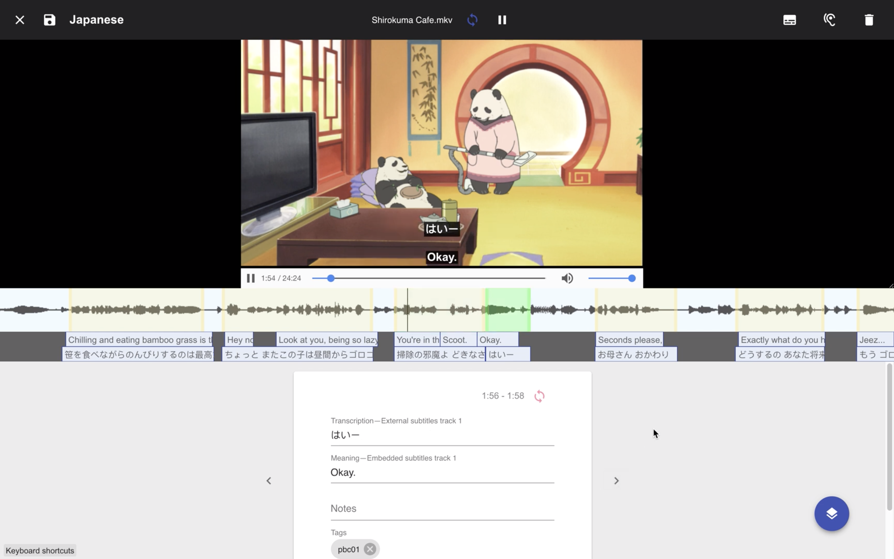

# Audio Flashcard Assistant

A cross-platform desktop application for turning audio and video files into flashcards.

It works like this:

1. Choose a media file.
2. Make your clips (manually or automatically).
3. Export your audio flashcards for use in [Anki](https://apps.ankiweb.net/).

Currently being built with [Electron](https://electronjs.org), [Create React App](https://github.com/facebookincubator/create-react-app), [Redux](https://redux.js.org/) and [RxJS](https://rxjs-dev.firebaseapp.com/). Audio processing is done with [ffmpeg](https://ffmpeg.org/) for audio processing.

### Demo: [Making cards automatically with subtitled video](https://www.youtube.com/watch?v=kFEfS8dyKQ8)
[](https://www.youtube.com/watch?v=kFEfS8dyKQ8)


### Development

To install NPM packages:

```
yarn install
```

Once packages are installed, you may run the dev build:

```
yarn start
```


Then, in another tab, open the Electron app:

```
yarn electron
```
